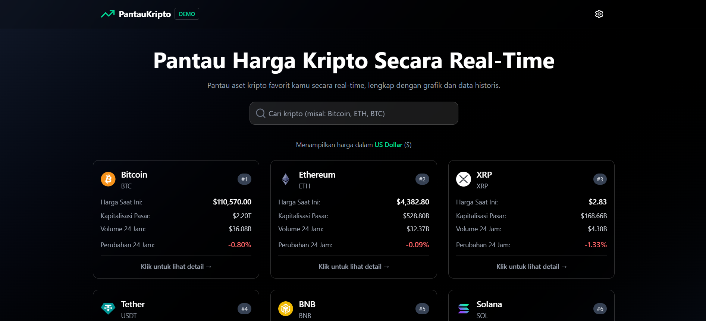

# 📊 PantauKripto

PantauKripto adalah aplikasi web untuk memantau harga aset kripto secara **real-time** dengan tampilan modern dan responsif.  
Aplikasi ini menggunakan **ReactJS (Frontend)** dan **Express.js (Backend)** dengan data yang diambil dari **CoinGecko API**.



---

## ✨ Fitur Utama

- 🔍 **Pencarian & Filter** — cari aset kripto favorit dengan cepat.
- 📈 **Grafik Harga Interaktif** — pantau pergerakan harga 24 jam, 7 hari, hingga 30 hari.
- 💰 **Dukungan Multi-Mata Uang** — tampilkan harga dalam IDR atau USD.
- 📊 **Ringkasan Pasar** — lihat tren pasar secara keseluruhan.
- 🌙 **Dark Mode** — antarmuka modern dengan dukungan tema gelap.
- ⚡ **Caching & Rate Limit Handling** — backend menggunakan cache untuk mengurangi beban API CoinGecko.

---

## 🛠️ Tech Stack

- **Frontend:** ReactJS + React Router + TailwindCSS
- **Backend:** Node.js + Express.js
- **Data Provider:** [CoinGecko API](https://www.coingecko.com/en/api)
- **Deploy:** Vercel (frontend) & Railway (backend)

---

## 🚀 Instalasi & Menjalankan Project

### 1. Clone Repository

```bash
git clone https://github.com/IchwanArdi/PantauKripto.git
cd pantaukripto
```

### 2. Setup Backend

```bash
cd server
npm install
```

Buat file `.env`:

```env
PORT=3001
COINGECKO_BASE=https://api.coingecko.com/api/v3
```

Jalankan server:

```bash
npm start
```

### 3. Setup Frontend

```bash
cd client
npm install
npm run dev
```

Buka di browser:  
👉 `http://localhost:5173`

---

## 📡 Arsitektur

```
[Client: ReactJS] ---> [Backend Proxy: Express.js] ---> [CoinGecko API]
```

- **Frontend**: Melakukan request ke backend (proxy).
- **Backend**: Mengatur caching, rate limit handling, dan forward request ke CoinGecko.

---

## ⚠️ Catatan Penting

- Data harga kripto pada aplikasi ini diambil secara real-time dari layanan pihak ketiga (CoinGecko).
- Dalam kondisi tertentu, data mungkin tidak dapat dimuat sepenuhnya akibat **batasan API** atau kendala **koneksi jaringan**.

---

## 📜 Lisensi

Proyek ini bersifat open-source dan tersedia di bawah lisensi **MIT**.
